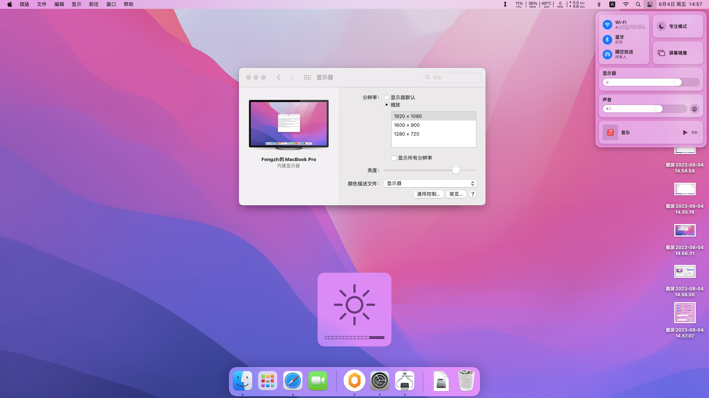
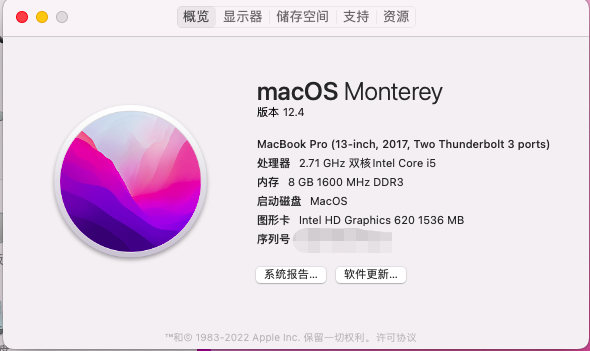

# AcerP238Hackintosh
## Acer P238 Opencore引导文件
## 效果截图

根据https://github.com/cn2156/Acer-TMTX50-Hackintosh-OpenCore 制作的EFI引导文件

## 硬件配置
|   描述   |                           设备                            |  VEN_DEV  | 驱动情况 |
| -------- | -------------------------------------------------------- | --------- | -------- |
| 型号     | Acer TravelMate P238-G2-M-55C8                           |           |          |
| CPU      | Intel® Core™ i5-7200U Processor                          | Kaby Lake | ✅完成    |
| 显卡     | Intel® HD Graphics 620                                   | 8086-5916 | ✅完成     |
| 声卡     | Realtek ALC255                                           | 10EC-0255 | ✅完成     |
| 网卡     | Realtek RTL8168/8111 PCI-E Gigabit Ethernet Adapter      | 10EC-8168 | ✅完成      |
| 无线网卡 | Intel Dual Band Wireless-AC 7265 AC 2x2 HMC WiFi Adapter | 8086-095A |   ✅完成     |
| 蓝牙     | 英特尔(R) 无线 Bluetooth(R)                                | 8087-0A2A | ✅完成       |
| WebCam   | HD WebCam                                                | 04F2-B520 | ✅完成    |
| 触控板   | Synaptics TMP2991                                        | I2C1.TPD1 |   ❌错误        |
| 读卡器   | Realtek USB 2.0 Card Reader                              | 0BDA-0129 |  ❎未完成        | 

OpenCore版本:0.8.3
OSX:12.4
## 感谢https://apple.sqlsec.com/ 国光老师提供教程。
